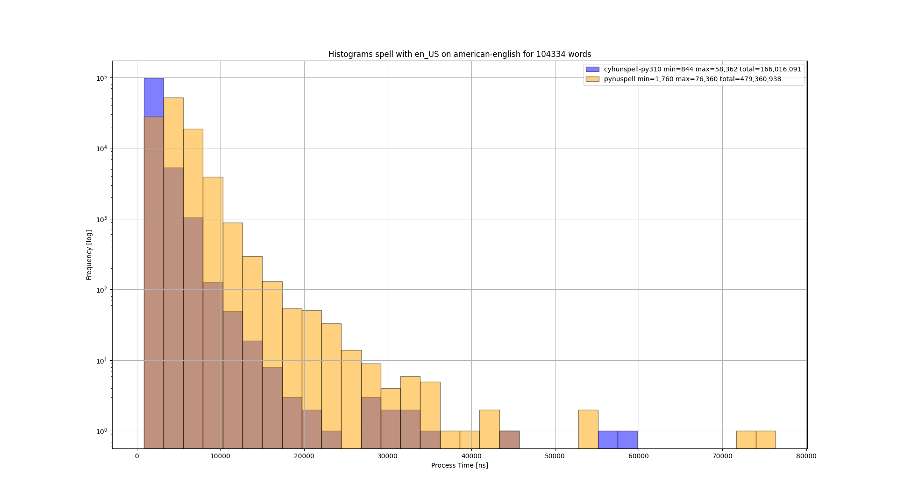
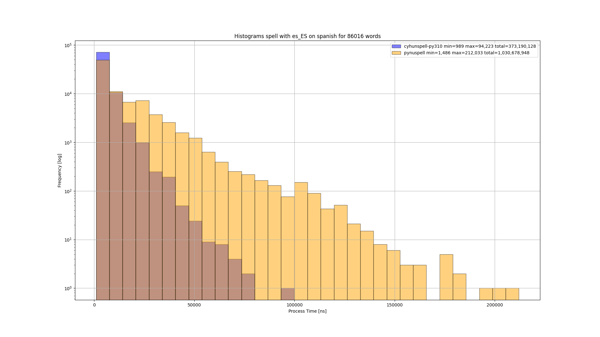
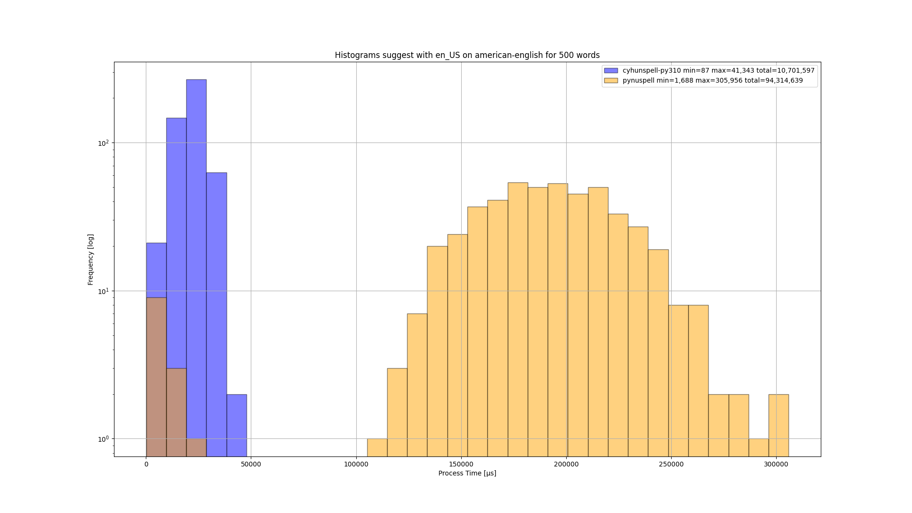
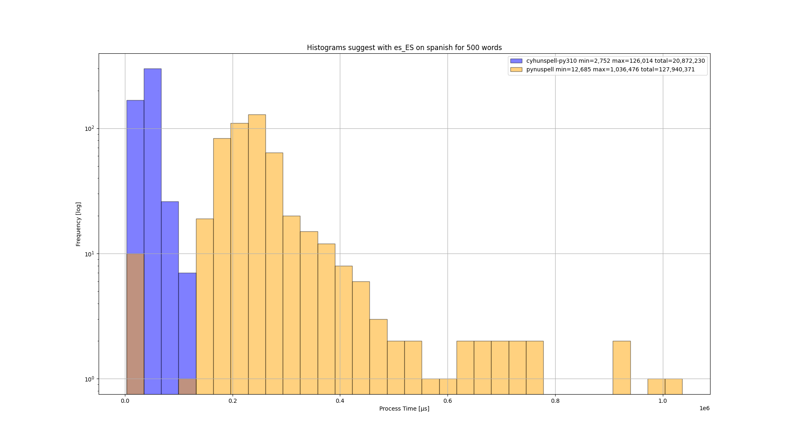
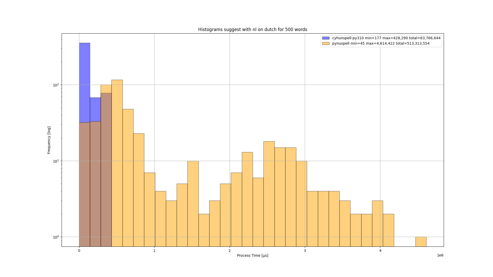

# pynuspell-comparison

Comparing Python moduel for Nuspell with those for Hunspell

## Installation

     sudo apt-get install libnuspell5 libhunspell-1.7
     hunspell-en-us hunspell-es \
     hunspell-nl wamerican wspanish wdutch
     pip install -U pandas matplotlib pynuspell cyhunspell-py310

## Running

Run

    ./compare.py

and the results are in PNG files. Note the break to limit total test time for suggestions.

## Results

Spell

Suggest

## See also

See also:
- https://pypi.org/project/pynuspell/
- https://pypi.org/project/cyhunspell-py310/

Old:
- https://pypi.org/project/hunspell/
- https://pypi.org/project/chunspell/
- https://pypi.org/project/cyhunspell/
