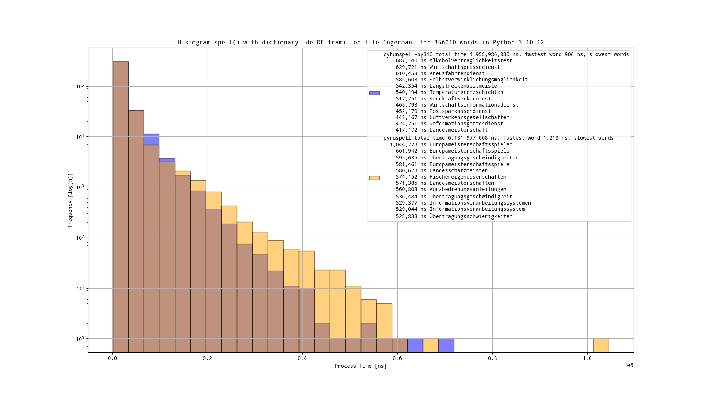
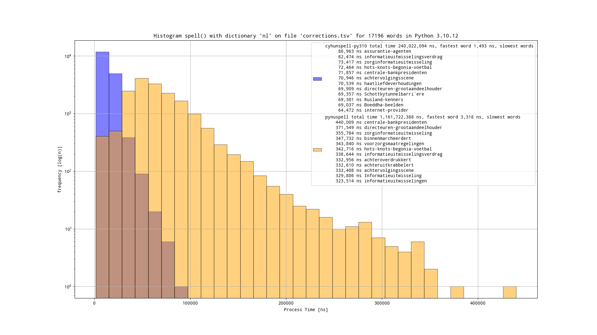
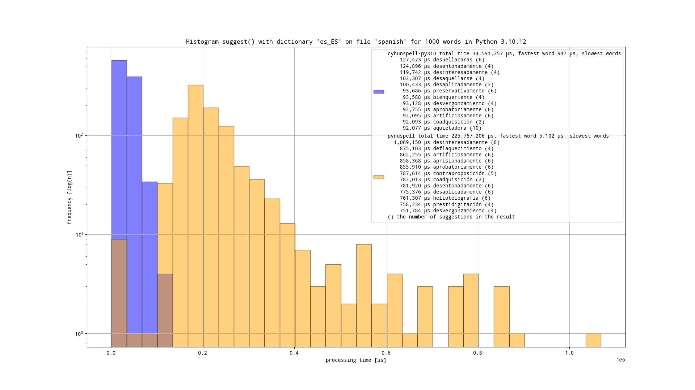

# pynuspell-comparison

Comparing Python moduel for Nuspell with those for Hunspell

## Installation

     sudo apt-get install libnuspell5 libhunspell-1.7 hunspell-en-us \
     hunspell-es hunspell-de-de-frami hunspell-fr-comprehensive hunspell-nl \
     wamerican wspanish wngerman wfrench wdutch
     pip install -U pandas matplotlib pynuspell cyhunspell-py310

## Running

Run

    ./compare.py

and the results are in PNG files. Note the break to limit total test time for suggestions.

## Results

`spell()`

`suggest()`

`len(suggest())`

## See also

See also:
- https://nuspell.github.io/
- https://pypi.org/project/pynuspell/
- https://pypi.org/project/cyhunspell-py310/
- https://github.com/OpenTaal/opentaal-wordlist

Old:
- https://pypi.org/project/hunspell/
- https://pypi.org/project/chunspell/
- https://pypi.org/project/cyhunspell/
